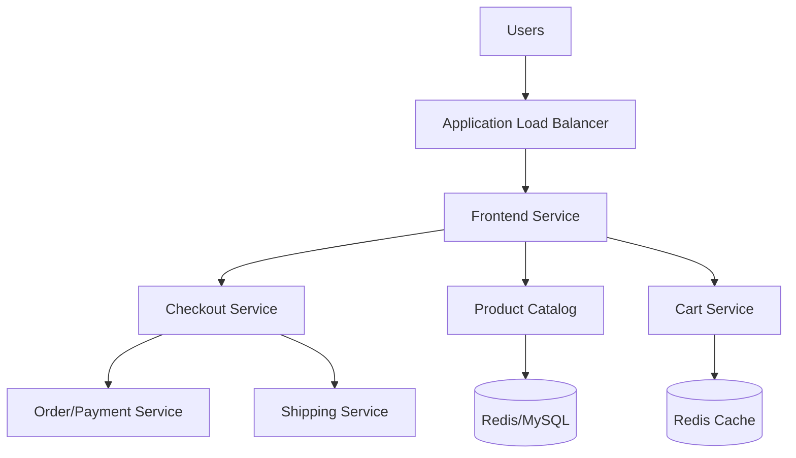

# Terraform Project: Full Microservices E-Commerce Application on AWS EKS

[](https://www.google.com/search?q=https://github.com/Chinthaparthy-UmasankarReddy/Microservices-E-Commerce-eks-project.git)
[](https://www.google.com/search?q=%23)
[](https://www.google.com/search?q=%23)

## 🎯 Project Overview

**Level:** Advanced  
**Estimated Time:** 60 minutes  
**Cost:** **\~$2.00/day** (EKS Cluster + Managed Node Groups + ALB)  
**Real-World Use Case:** Scalable e-commerce platforms, high-traffic retail applications, polyglot microservices architecture.

This project deploys a **production-ready 11-service e-commerce platform** including:

  - **EKS Cluster** with Managed Node Groups
  - **11 Microservices** (Java, Go, Python, Node.js, etc.)
  - **Infrastructure as Code** via Terraform
  - **CI/CD Automation** with Jenkins Pipelines
  - **Container Registry** using AWS ECR
  - **Monitoring** with Prometheus & Grafana

## 📋 Table of Contents

  - [Features](https://www.google.com/search?q=%23features)
  - [Architecture](https://www.google.com/search?q=%23architecture)
  - [Prerequisites](https://www.google.com/search?q=%23prerequisites)
  - [Quick Start](https://www.google.com/search?q=%23quick-start)
  - [File Structure](https://www.google.com/search?q=%23file-structure)
  - [Microservices Breakdown](https://www.google.com/search?q=%23microservices-breakdown)
  - [Industry Best Practices](https://www.google.com/search?q=%23industry-best-practices)
  - [Real-time Interview Questions](https://www.google.com/search?q=%23real-time-interview-questions)
  - [Clean Up](https://www.google.com/search?q=%23clean-up)

## ✨ Features

| Feature | Implemented | Tool/Resource |
|---------|-------------|-------------------|
| Cluster Orchestration | ✅ | `aws_eks_cluster` |
| Auto-scaling Nodes | ✅ | `aws_eks_node_group` |
| CI/CD Pipeline | ✅ | Jenkins + Groovy |
| Artifact Storage | ✅ | AWS ECR |
| Ingress Control | ✅ | AWS Load Balancer Controller |
| Observability | ✅ | Prometheus & Grafana |
| State Management | ✅ | S3 Bucket + DynamoDB Lock |

## 🏗️ Architecture *(Microservices Flow)*



## 🛠️ Prerequisites

```bash
# 1. AWS CLI & Terraform Configured
aws sts get-caller-identity

# 2. Tools Required
- kubectl (Kubernetes CLI)
- eksctl (EKS Management)
- Helm (Package Manager)
- Jenkins (Running on EC2 Jumphost)

# 3. IAM Permissions
- eks:CreateCluster
- ec2:CreateVpc
- iam:CreateRole
- ecr:CreateRepository
```

## 🚀 Quick Start

```bash
# 1. Clone the repository
git clone https://github.com/Chinthaparthy-UmasankarReddy/Microservices-E-Commerce-eks-project.git
cd Microservices-E-Commerce-eks-project

# 2. Setup S3 Backend for Terraform
cd s3-buckets
terraform init && terraform apply -auto-approve

# 3. Deploy EKS Infrastructure via Jenkins
# Create a Jenkins job pointing to eks-terraform/eks-jenkinsfile
# Action: apply
```

## 📁 File Structure

```
Microservices-E-Commerce-eks-project/
├── eks-terraform/          # EKS Cluster & Node Groups
├── ecr-terraform/          # Elastic Container Registries
├── s3-buckets/             # Terraform State storage
├── kubernetes-manifests/    # K8s Deployments & Services
├── helm-charts/            # Helm deployment logic
└── Jenkinsfile             # CI/CD Pipeline definitions
```

## 🛒 Microservices Breakdown

| Service | Language | Function |
|---------|----------|----------|
| **Frontend** | Next.js | Web UI for users |
| **Cart** | Node.js | User shopping cart |
| **ProductCatalog** | Go | Product data & search |
| **Currency** | C++ | Exchange rate logic |
| **Payment** | Python | Transaction processing |
| **Shipping** | Java | Logistics & tracking |

## 🏆 Industry Best Practices Applied

| Practice | Implemented | Why Important |
|----------|-------------|--------------|
| ✅ **Managed Node Groups** | AWS Managed | Auto-patching & scaling |
| ✅ **Remote State** | S3 + DynamoDB | Team collaboration & locking |
| ✅ **IAM OIDC** | Service Roles | Fine-grained pod permissions |
| ✅ **Helm Versioning** | Charts | Consistent deployments |
| ✅ **Spot Instances** | Cost Config | Up to 70% cost savings |

## 💬 Real-time Interview Questions

### **🔥 EKS & Microservices Questions**

**Q1: How do services communicate within the cluster?** A: Using CoreDNS for internal service discovery (ClusterIP) and Nginx/ALB Ingress for external traffic.

**Q2: Why use ECR over Docker Hub in production?** A: Lower latency within AWS, IAM-integrated security, and no pull rate limits for internal traffic.

**Q3: How do you handle secrets for the 11 services?** A: External Secrets Operator or AWS Secrets Manager integrated via CSI Driver.

## 🧹 Clean Up

```bash
# Destroy EKS cluster to stop costs
# Run Jenkins job with Action: destroy

# Alternatively
cd eks-terraform
terraform destroy -auto-approve

# Remove S3 state bucket
cd ../s3-buckets
terraform destroy -auto-approve
```

## 📄 License

MIT License - Free for learning/portfolio

-----

**⭐ Star the Project: [Github Repo](https://www.google.com/search?q=https://github.com/Chinthaparthy-UmasankarReddy/Microservices-E-Commerce-eks-project.git)** 


```bash
terraform destroy -auto-approve
terraform destroy -auto-approve --force
```
